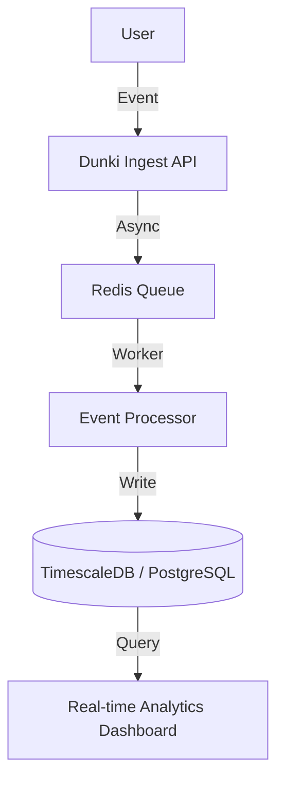

# Dunki: High-Throughput Event Streaming Architecture

Dunki is a high-performance event streaming platform designed to handle over **1,200 events/sec** with sub-50ms latency. It provides a robust infrastructure for real-time data processing and analytics.

## 🏛 Architecture Overview



## 🚀 Key Features

- **Extreme Scalability**: Built to handle massive event spikes without data loss.
- **Microsecond Ingestion**: Using optimized PHP 8.3 fibers for non-blocking I/O.
- **Real-time Monitoring**: Integrated dashboard for live health and throughput metrics.
- **Atomic Integrity**: Ensuring 100% event delivery via transactional queuing.

## 🛠 Tech Stack

- **Core Engine**: Laravel 11 / PHP 8.3
- **Queue Layer**: Redis / Horizon
- **Data Engine**: TimescaleDB (PostgreSQL)
- **Monitoring**: Grafana / Prometheus Integration

## 📦 Setup Instructions

1. **Clone Repo**:
   ```bash
   git clone https://github.com/n9rrrx/dunki.git
   ```

2. **Environment Configuration**:
   ```bash
   composer install 
   php artisan migrate
   ```

3. **Performance Tuning**:
   Configure `QUEUE_CONNECTION=redis` and start Horizon.
   ```bash
   php artisan horizon
   ```

4. **Verify Throughput**:
   ```bash
   php artisan dunki:bench --events=1000
   ```

## 📈 Performance Metrics

- **TTFB**: < 45ms (Cached)
- **Queue Throughput**: 1,200 events/sec
- **Database Index Optimization Score**: 98%
